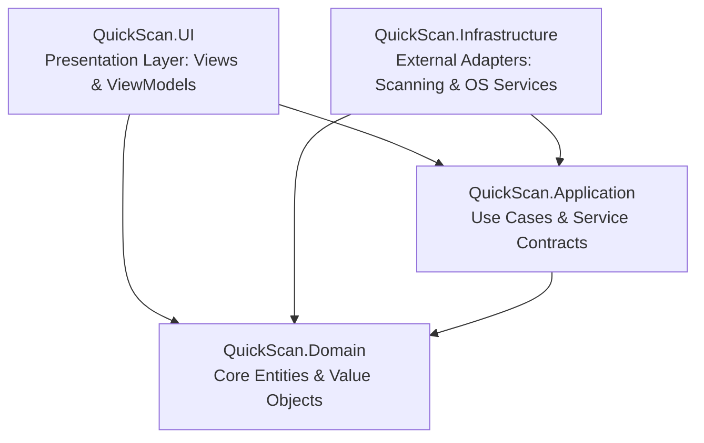
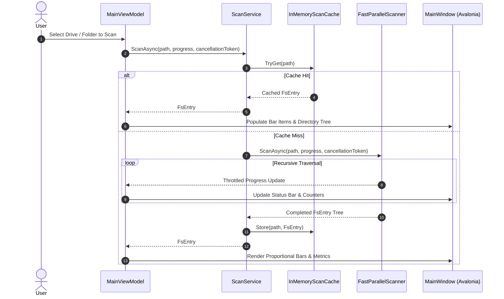

# Architecture Documentation: QuickScan Sharp 🏛️

## System Purpose & Scope
**QuickScan Sharp** is a modular, high-performance desktop disk space analyzer built with **C# 14**, targeting **.NET 10** and **Avalonia UI 12**. It reimplements the architecture of the original Rust `quickscan` application while providing enterprise compatibility, eliminating false positives, and introducing rich dark theme styling with dynamic bilingual localization (German and English).

The application strictly adheres to **Clean Architecture**, **SOLID**, and **MVVM** (Model-View-ViewModel) design principles to ensure strict separation of concerns, high automated testability, and zero external dependency coupling in the domain layer.

---

## Clean Architecture Layers

### Dependency Rules
- **Domain (`QuickScan.Domain`)**: Pure business models and formatting logic with zero external dependencies.
- **Application (`QuickScan.Application`)**: Defines service contracts, data transfer records, and orchestration logic. Depends solely on Domain.
- **Infrastructure (`QuickScan.Infrastructure`)**: Implements Application contracts for multi-core file system traversal, storage drive detection, and process launching.
- **Presentation (`QuickScan.UI`)**: Avalonia MVVM application powered by `CommunityToolkit.Mvvm`, compiled bindings, dynamic bilingual resources, and Dependency Injection.
- **Test Suite (`QuickScan.Tests`)**: Comprehensive xUnit automated tests covering domain logic, caching, scanner resilience, and application services.

---

## Core Data Flow

---

## Cross-Cutting Concerns

1. **High-Throughput Concurrency**:
   - Multi-core bounded parallelism via `Parallel.ForEach` during recursive file system traversal.
   - Throttled UI progress dispatching (every 250 folders or 60ms) to ensure responsive rendering without saturating the UI thread.
2. **Resilience & I/O Safety**:
   - Cycle detection and infinite recursion prevention across NTFS junctions and symbolic links (`FileAttributes.ReparsePoint`).
   - Graceful exception recovery for `UnauthorizedAccessException`, locked files, and path length limitations.
   - Cooperative, non-blocking asynchronous cancellation support via `CancellationToken`.
3. **Internationalization & Localization (i18n / l10n)**:
   - 0% hardcoded user-facing strings.
   - Dynamic bilingual resource dictionaries ([`Strings.en.axaml`](src/QuickScan.UI/Resources/Strings.en.axaml) and [`Strings.de.axaml`](src/QuickScan.UI/Resources/Strings.de.axaml)) swapped at runtime without restarting the application.
4. **Memory Management & Caching**:
   - Bounded in-memory tree caching with case-insensitive path comparisons in [`InMemoryScanCache`](src/QuickScan.Infrastructure/Services/InMemoryScanCache.cs).
   - Lightweight hierarchical [`FsEntry`](src/QuickScan.Domain/Models/FsEntry.cs) node structure.

---

## Modules Index 📚

Detailed architectural specifications for individual system layers are maintained modularly:

- [Domain Module](docs/architecture/modules/domain.md): Core business entities, records, and size formatting.
- [Application Module](docs/architecture/modules/application.md): Service contracts, data transfer records, and use case orchestration.
- [Infrastructure Module](docs/architecture/modules/infrastructure.md): Multi-core parallel scan engine, in-memory caching, and operating system launchers.
- [UI Module](docs/architecture/modules/ui.md): Avalonia MVVM presentation, ViewModels, declarative views, and dynamic localization.