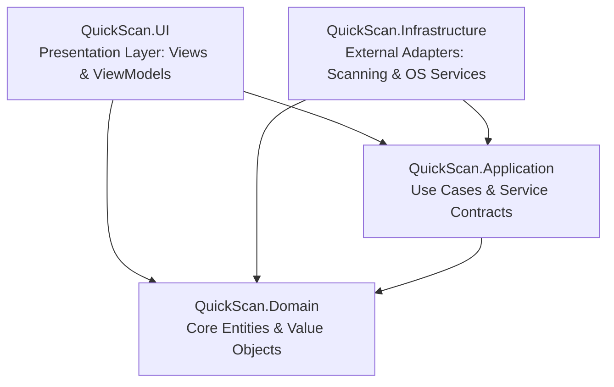
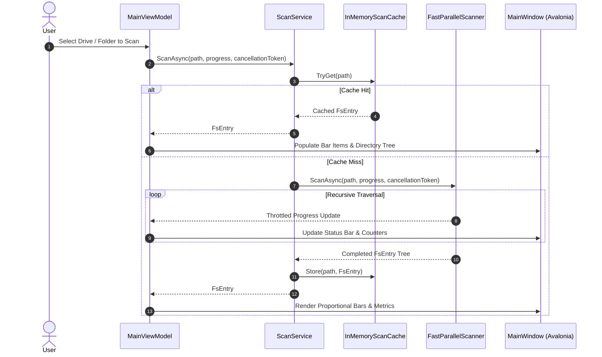

# Architecture Overview: QuickScan Sharp

## System Purpose & Scope
**QuickScan Sharp** is a high-performance desktop disk space analyzer built with **C# 14**, targeting **.NET 10** and **Avalonia UI 12**. It provides instant visual insights into disk space distribution with interactive proportional bar charts, hierarchical directory navigation, drive selection, and dynamic bilingual localization (German and English).

The application follows the principles of **Clean Architecture** and **MVVM** (Model-View-ViewModel) to ensure strict separation of concerns, high testability, and zero external dependency coupling in the core domain logic.

---

## Clean Architecture Layers

### Dependency Rules
- **Domain** has no dependencies on other projects or external frameworks.
- **Application** depends solely on **Domain**. It defines use cases and abstract contracts.
- **Infrastructure** implements **Application** contracts and coordinates external I/O (file system, process launching, drive detection).
- **UI** depends on **Application** and **Domain** (as well as Infrastructure for IoC registration at composition root).

---

## Core Data Flow

---

## Cross-Cutting Concerns

1. **Concurrency & Throughput**:
   - Multi-core bounded parallelism via `Parallel.ForEach` during file system scanning.
   - Throttled UI progress dispatching (every 250 folders or 60 ms) to keep the UI responsive.
2. **Resilience & I/O Safety**:
   - Protection against infinite recursion across NTFS junctions and symlinks via `FileAttributes.ReparsePoint`.
   - Resilient error handling for `UnauthorizedAccessException`, locked files, and deleted directories.
   - Cooperative asynchronous cancellation via `CancellationToken`.
3. **Internationalization & Localization (i18n / l10n)**:
   - 0% hardcoded user-facing strings.
   - Dynamic bilingual resource dictionaries ([`Strings.en.axaml`](file:///c:/projekte/csharp/quickscan/src/QuickScan.UI/Resources/Strings.en.axaml) and [`Strings.de.axaml`](file:///c:/projekte/csharp/quickscan/src/QuickScan.UI/Resources/Strings.de.axaml)) swapped at runtime without restarting the application.
4. **Memory Management**:
   - Efficient memory layout with hierarchical [`FsEntry`](file:///c:/projekte/csharp/quickscan/src/QuickScan.Domain/Models/FsEntry.cs) nodes.
   - Bounded caching in [`InMemoryScanCache`](file:///c:/projekte/csharp/quickscan/src/QuickScan.Infrastructure/Services/InMemoryScanCache.cs) to prevent memory leaks during extended usage.

---

## Modules Index
Detailed module documentation:
- [Domain Module](file:///c:/projekte/csharp/quickscan/docs/architecture/modules/domain.md): Core business entities, records, and size formatting.
- [Application Module](file:///c:/projekte/csharp/quickscan/docs/architecture/modules/application.md): Service contracts, application models, and use case orchestration.
- [Infrastructure Module](file:///c:/projekte/csharp/quickscan/docs/architecture/modules/infrastructure.md): Parallel scan engine, caching, and operating system integration.
- [UI Module](file:///c:/projekte/csharp/quickscan/docs/architecture/modules/ui.md): Avalonia MVVM presentation, ViewModels, Views, and localization.
